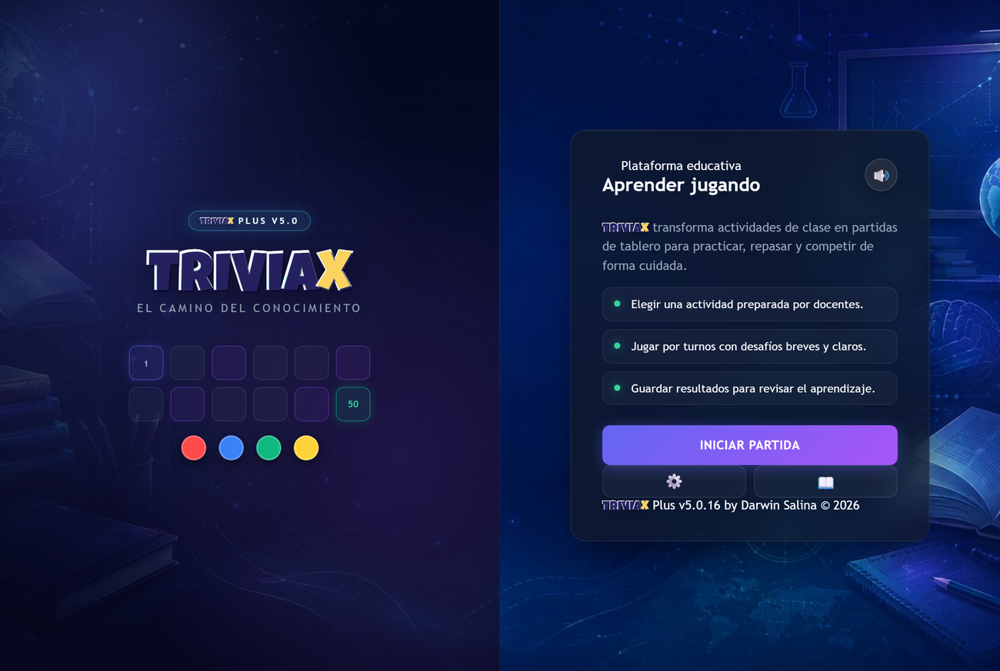
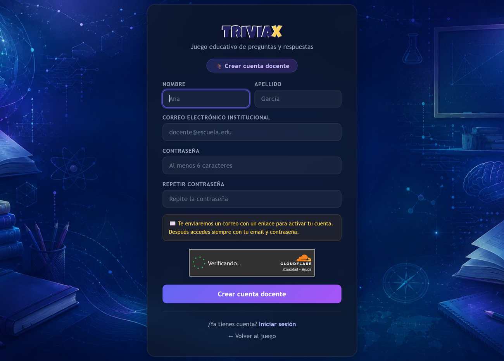
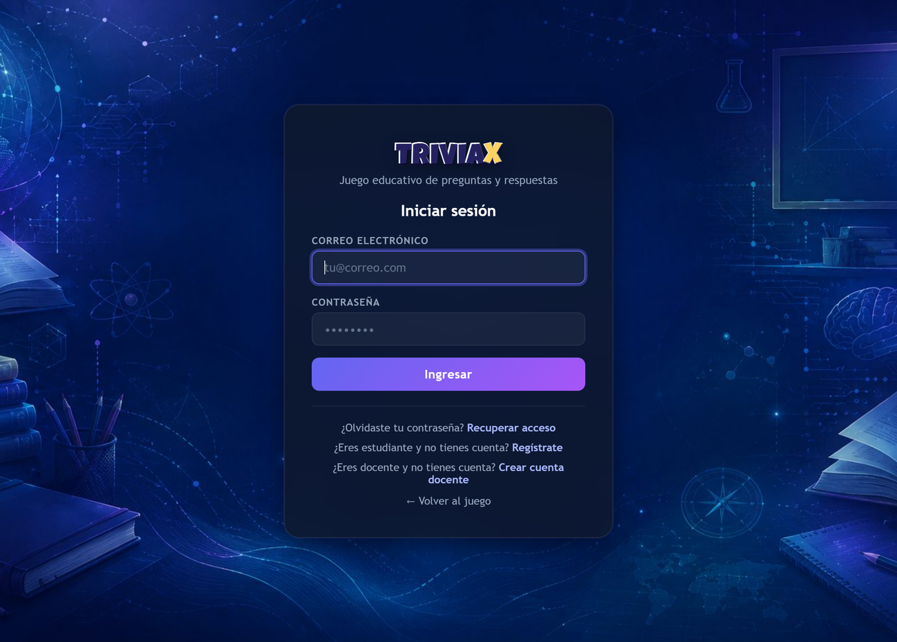
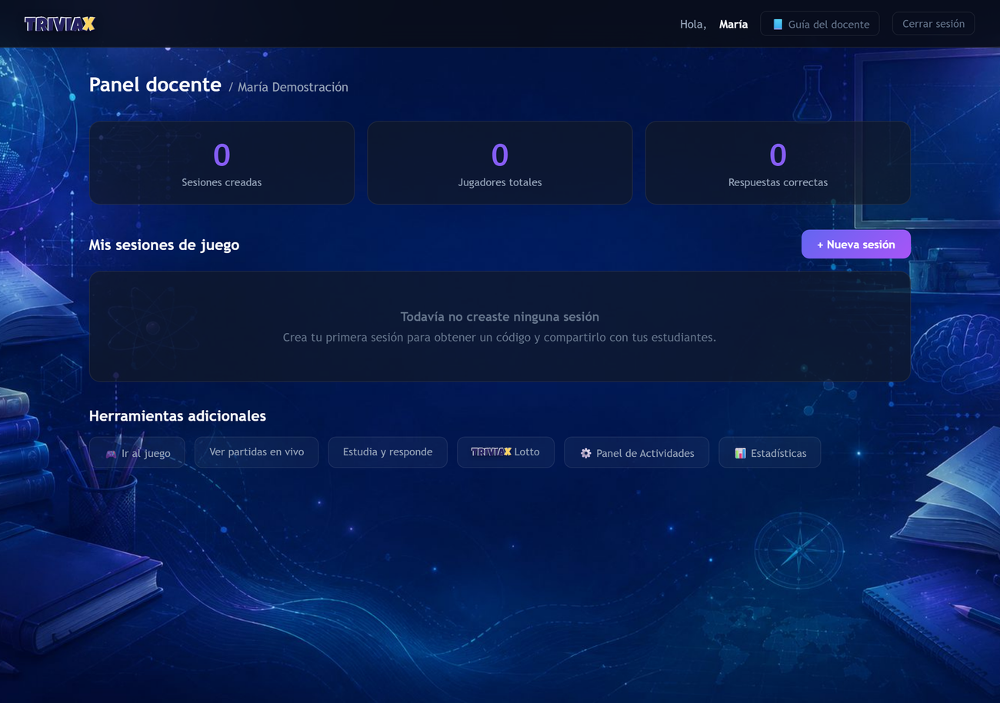
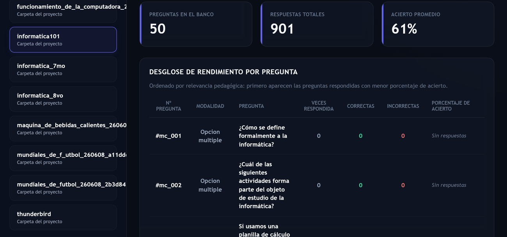
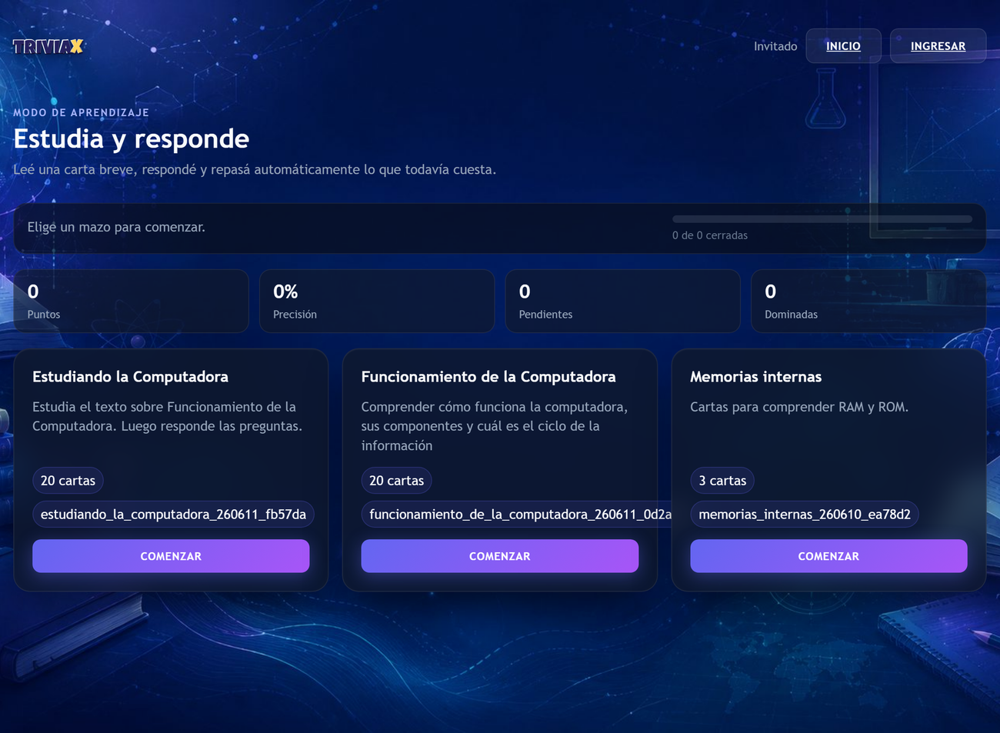
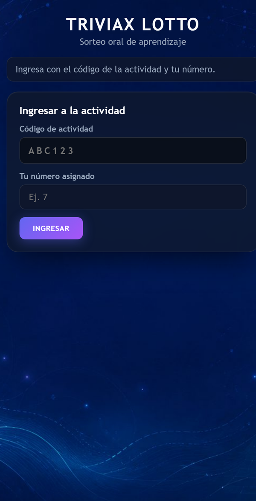

# Manual del Docente — TRIVIAX

> **El Camino del Conocimiento**
> Plataforma educativa para gamificar el aula, crear actividades y evaluar aprendizajes.

---

## Índice

1. [Qué es TRIVIAX](#1-qué-es-triviax)
2. [Qué puedes esperar como docente](#2-qué-puedes-esperar-como-docente)
3. [Qué viven tus estudiantes](#3-qué-viven-tus-estudiantes)
4. [Crear tu cuenta y acceder](#4-crear-tu-cuenta-y-acceder)
5. [El panel docente y las estadísticas](#5-el-panel-docente-y-las-estadísticas)
6. [Modalidad A — Juego de Tablero](#6-modalidad-a--juego-de-tablero)
7. [Modalidad B — Estudia y Responde](#7-modalidad-b--estudia-y-responde)
8. [Modalidad C — TRIVIAX Lotto](#8-modalidad-c--triviax-lotto)
9. [Tipos de desafíos que puedes crear](#9-tipos-de-desafíos-que-puedes-crear)
10. [Crear contenido con ayuda de la IA](#10-crear-contenido-con-ayuda-de-la-ia)
11. [Seguridad y privacidad](#11-seguridad-y-privacidad)
12. [Buenas prácticas y preguntas frecuentes](#12-buenas-prácticas-y-preguntas-frecuentes)

---

## 1. Qué es TRIVIAX

**TRIVIAX** es una plataforma educativa web que transforma cualquier tema de clase en una experiencia de juego. En lugar de un cuestionario plano, tus estudiantes tiran dados en un tablero, estudian con fichas inteligentes o participan de sorteos y evaluaciones orales proyectadas en la pizarra del salón.

La idea de fondo es simple: **aprender se disfruta más cuando se juega**, y el juego también te da información valiosa sobre qué entendió cada grupo y qué conviene repasar.

TRIVIAX reúne en un solo lugar tres formas complementarias de trabajar:

- Un **juego de tablero** para competir en equipos respondiendo preguntas.
- Un sistema de **fichas de estudio** para el repaso individual y autónomo.
- Una herramienta de **evaluación oral en vivo** con sorteos dinámicos para clases presenciales.

Todo se administra desde un panel pensado para docentes, sin necesidad de conocimientos técnicos.



*Pantalla de inicio de TRIVIAX: el punto de partida para jugar y acceder a las modalidades.*

---

## 2. Qué puedes esperar como docente

Con tu cuenta docente puedes:

- **Crear actividades** sobre cualquier materia y nivel, desde preguntas simples hasta desafíos interactivos (asociar pares, ordenar, clasificar, completar espacios).
- **Acelerar la creación con IA**: TRIVIAX te entrega instrucciones listas para pegar en un asistente como ChatGPT o Gemini, y luego importa el resultado en un clic.
- **Lanzar partidas de tablero** para tu grupo y compartir un código de acceso de 6 caracteres para que se sumen.
- **Publicar mazos de estudio** con repaso adaptativo para que tus estudiantes practiquen a su ritmo.
- **Dirigir evaluaciones orales** con sorteo proyectado, rúbrica de calificación y registro de observaciones.
- **Seguir el desempeño** de tu grupo con estadísticas que priorizan automáticamente las preguntas más difíciles.
- **Monitorear las partidas en vivo**, ver quién está conectado y cerrar la sesión cuando termina la clase.

Todo queda asociado a tu cuenta, así que puedes reutilizar tus actividades clase tras clase.

---

## 3. Qué viven tus estudiantes

Para que sepas qué van a encontrar del otro lado (tus estudiantes tienen su propio manual), esto es lo esencial:

- **Pueden sumarse sin complicaciones.** A una partida de tablero entran con un código de 6 caracteres; a una actividad Lotto, con el código y su número de lista.
- **No necesitan instalar nada.** Todo funciona desde el navegador del celular, la tablet o la computadora.
- **Pueden tener cuenta propia (opcional).** Si se registran, guardan su historial de partidas; si no, igual pueden jugar como invitados.
- **Nunca ven las respuestas correctas antes de tiempo.** El sistema las oculta en los dispositivos de los estudiantes para que la evaluación sea justa.

---

## 4. Crear tu cuenta y acceder

### 4.1. Registro abierto

El registro docente es **abierto**: no necesitas ningún código de habilitación. Desde la pantalla de inicio de TRIVIAX, elige **Crear cuenta docente** y completa:

- **Nombre y apellido.**
- **Correo electrónico.**
- **Contraseña** (mínimo 6 caracteres; se guarda cifrada, nadie puede leerla).

Si aparece una breve **verificación anti-robots**, complétala; en la mayoría de los casos es automática y ni siquiera tendrás que hacer clic. Esta verificación protege al sistema de registros masivos automatizados.



*Formulario de creación de cuenta docente, con la verificación anti-robots integrada.*

### 4.2. Verificación de tu correo

Por tu seguridad, la cuenta queda **inactiva hasta que confirmes tu correo**. Recibirás un email con un enlace de activación: al abrirlo, tu cuenta se activa y entras directamente a tu panel. El enlace tiene una validez limitada; si vence, simplemente vuelve a registrarte.

> **Consejo:** si no ves el correo en unos minutos, revisa la carpeta de spam o correo no deseado.

### 4.3. Iniciar sesión

Una vez activada la cuenta, ingresas siempre con tu **correo y contraseña** desde la opción **Iniciar sesión**. Tu acceso ya no depende de ningún código compartido.



*Inicio de sesión con correo y contraseña, común para docentes y estudiantes.*

---

## 5. El panel docente y las estadísticas

Al iniciar sesión llegas a tu **panel**, el centro de mando de TRIVIAX. Desde allí accedes a las tres modalidades:

1. **Mis sesiones de tablero** — crear, monitorear y cerrar partidas.
2. **Estudia y Responde** — diseñar y publicar mazos de repaso.
3. **TRIVIAX Lotto** — configurar y lanzar rondas de sorteo y evaluación oral.



*Panel docente: métricas rápidas, tus sesiones y accesos a todas las herramientas.*

### 5.1. Estadísticas acumuladas

En la sección de **Estadísticas** ves el desempeño consolidado de las actividades jugadas con código de sesión:

- **Orden pedagógico:** las preguntas se ordenan automáticamente mostrando primero las de **menor porcentaje de acierto** (las que más cuestan a tu grupo), y dejan al final las que aún nadie respondió. Así detectas de un vistazo qué conviene repasar.
- **Actualización en vivo:** con el botón **Actualizar datos** refrescas el reporte mientras la clase juega, con la marca de hora de la última carga.



*Desglose de rendimiento por pregunta, ordenado primero por las de menor acierto.*

---

## 6. Modalidad A — Juego de Tablero

La modalidad insignia: hasta **4 jugadores o equipos** compiten en un tablero, tiran el dado y responden desafíos. Ideal para repasar en grupo y cerrar una unidad con energía.

### 6.1. Crear una sesión de tablero

1. En tu panel, entra a **Mis sesiones de tablero** y elige **Nueva sesión**.
2. Selecciona la **actividad** que quieres jugar.
3. Elige el **tipo de sesión**:
   - **Educativa:** exclusiva para tu grupo del aula.
   - **Abierta:** pública, pensada para torneos o campeonatos del colegio.
4. El sistema genera un **código de acceso de 6 caracteres** (por ejemplo, `MAT102`).
5. **Comparte ese código** con tus estudiantes para que se sumen.

### 6.2. Configurar la partida

Antes de empezar puedes ajustar:

- **Código de sesión:** si los estudiantes ingresan el código, los puntajes se **guardan** y alimentan tus estadísticas. Si juegan sin código, la partida sirve solo para practicar y los resultados no se conservan.
- **Tipo de tablero:**
  - *Oca tradicional* — 50 casillas; se gana por meta exacta o por puntos.
  - *Monopoly educativo* — 40 casillas en circuito cerrado; se juega por puntos.
  - *Circular* — 36 casillas simplificadas; se juega por puntos.
- **Forma de ganar:** llegar a la meta, meta exacta (si el dado se pasa, retrocede el sobrante) o alcanzar un puntaje objetivo (de 50 a 250 puntos).
- **Tiempo de respuesta:** configurable por pregunta (30 segundos es un buen punto de partida) o sin límite.
- **Penalizaciones:** perder el próximo turno, restar puntos, o ambas.

### 6.3. Juego justo y sin errores

TRIVIAX coordina cada partida con el servidor para que sea **confiable incluso con muchos dispositivos conectados**:

- **Sin puntos duplicados:** si un estudiante toca el botón varias veces por mala conexión, su respuesta se registra una sola vez.
- **Identidad protegida:** cada participante juega con una credencial propia; nadie puede responder en nombre de otro.
- **Sin pestañas tramposas:** si alguien abre la misma partida en dos pestañas, la segunda pasa a **solo lectura** automáticamente.

### 6.4. Durante y al final de la clase

Desde el detalle de la sesión puedes seguir el avance en vivo y, cuando termina la clase, **cerrar la sesión**. Los resultados quedan disponibles en tus estadísticas.

---

## 7. Modalidad B — Estudia y Responde

Una modalidad **individual** para el autoestudio. No usa dados ni tablero: cada estudiante avanza por un mazo de **fichas de estudio** a su propio ritmo.

```
Creas el mazo  →  lo publicas  →  tus estudiantes entran  →  estudian y responden
```

### 7.1. Repaso adaptativo (método Leitner)

Cada ficha presenta un concepto breve (unas pocas líneas) y luego una pregunta:

- Si el estudiante **acierta**, la ficha "sube de caja" y tarda más en volver a aparecer.
- Si **falla**, el sistema la reprograma para que reaparezca pronto.

Así cada estudiante repasa **justo lo que más le cuesta**, hasta dominarlo.

### 7.2. Crear un mazo

En la sección **Estudia y Responde** de tu panel, elige **Crear actividad (asistente)** y sigue los pasos:

1. Escribe el **título** y la **descripción** del mazo.
2. Define cuántas fichas tendrá y qué tipos de pregunta admite.
3. Elige el método de carga:
   - **Manual:** completas ficha por ficha (texto de estudio, pregunta, respuestas correctas e incorrectas y explicación).
   - **Asistente con IA:** copias el texto guía que te da TRIVIAX, lo pegas en ChatGPT o Gemini junto a tu material, y traes de vuelta el resultado.
4. Pulsa **Validar** para detectar errores y luego **Publicar**.

### 7.3. Compartir con tus estudiantes

Una vez publicado, comparte el mazo desde tu panel. Tus estudiantes podrán resolverlo desde la **biblioteca de estudio**, donde encuentran los mazos disponibles.



*Biblioteca de mazos: cada estudiante elige uno y avanza ficha por ficha a su ritmo.*

---

## 8. Modalidad C — TRIVIAX Lotto

Pensada para **clases presenciales** y evaluaciones formativas uno a uno mediante **sorteos en vivo** proyectados en la pizarra del salón. Combina estudio, redacción y exposición oral.

```
Ingreso abierto  →  Estudio  →  Redacción  →  Rondas orales  →  Cierre
```

### 8.1. Paso a paso en el aula

1. **Crea la actividad Lotto** desde tu panel: título, grupo, lista de estudiantes y el apunte de clase (que el asistente puede convertir en fichas con ayuda de IA).
2. **Abre el ingreso.** Proyecta la **pizarra** en el salón. Tus estudiantes entran desde sus dispositivos con el código de la actividad y seleccionan su número de lista.



*Así ingresan tus estudiantes a una actividad Lotto: código de actividad y número de lista.*
3. **Fase de estudio.** Inicias la lectura: cada estudiante ve su ficha (texto de estudio y preguntas guía) **sin** las respuestas correctas. Tienen un tiempo para leer (prorrogable).
4. **Fase de respuesta.** Cada estudiante redacta y **envía** por escrito su respuesta a la pregunta de su tema.
5. **Rondas orales.** Las pantallas de los estudiantes se bloquean. En la pizarra aparece un **carrusel de sorteo**: al pulsar **Sortear**, las tarjetas giran y se detienen en un estudiante con un destello dorado.
6. **Evaluación oral.** Al pulsar **Evaluar oral**, se abre en la pizarra la respuesta escrita del estudiante junto a la pregunta sugerida, la **rúbrica** (puntaje por criterio) y un espacio para tus observaciones.
7. **Cierre.** Cuando terminas, pulsas **Finalizar actividad**: la sesión se cierra y se genera un **reporte con las calificaciones** en tu historial.

### 8.2. Monitoreo de conexión en vivo

Los dispositivos envían una señal periódica al sistema. Si un estudiante se queda sin conexión, su indicador en la pizarra se marca en **rojo suave (desconectado)**. Así evitas sortear a alguien que se quedó sin batería o sin señal. Si hace falta, puedes **liberar** su número para que vuelva a ingresar.

---

## 9. Tipos de desafíos que puedes crear

Tus actividades pueden combinar varios tipos de desafío, además de la pregunta clásica:

| Tipo | Qué hace el estudiante |
|---|---|
| **Opción múltiple** | Elige la respuesta correcta entre 3 o 4 opciones. |
| **Verdadero / Falso** | Decide si una afirmación es verdadera o falsa. |
| **Asociar pares** | Une cada término con su definición (de 2 a 6 pares). |
| **Ordenar elementos** | Coloca una serie de pasos o elementos en el orden correcto. |
| **Clasificar elementos** | Arrastra cada elemento a su categoría correspondiente. |
| **Completar espacios** | Elige la palabra correcta en cada hueco de una frase. |

Esta variedad te permite evaluar desde el reconocimiento simple hasta la comprensión de procesos y relaciones.

---

## 10. Crear contenido con ayuda de la IA

Tanto en **Estudia y Responde** como en **TRIVIAX Lotto**, TRIVIAX te ofrece un **asistente** que arma el texto de instrucciones ideal para un modelo de lenguaje (ChatGPT, Gemini u otro). El flujo es:

1. **Copia** el texto guía que te entrega TRIVIAX.
2. **Pégalo** en tu asistente de IA junto con tu material de clase (un resumen, apunte o documento).
3. **Pega de vuelta** en TRIVIAX el resultado que te devuelve la IA.

### Recomendaciones para un buen resultado

- Pide a la IA que responda **únicamente con el contenido estructurado**, sin saludos, explicaciones ni adornos.
- Ajusta el material y las explicaciones al **nivel de tu grupo** (por ejemplo, lenguaje para estudiantes de 12 años).
- Antes de guardar, usa el botón **Validar**: TRIVIAX revisa la estructura y, si algo falta, te indica **en español** exactamente qué corregir.

> Siempre conviene **revisar pedagógicamente** lo que genera la IA: tú conoces a tu grupo mejor que cualquier modelo.

---

## 11. Seguridad y privacidad

TRIVIAX cuida la información de docentes y estudiantes:

- **Contraseñas cifradas:** se almacenan con técnicas seguras; ni siquiera el administrador puede leerlas.
- **Registro protegido:** varias capas (límite de intentos por conexión, verificación anti-robots y otros controles) impiden el registro masivo automatizado y los abusos.
- **Respuestas ocultas:** los estudiantes no pueden "espiar" las respuestas correctas desde su navegador; el sistema las retira de los datos que llegan a sus dispositivos.
- **Protección de formularios:** todas las acciones del panel exigen una validación de seguridad interna que bloquea solicitudes fraudulentas.
- **Protección contra fuerza bruta:** tras varios intentos fallidos de inicio de sesión desde una misma conexión, el acceso se bloquea temporalmente.

### Sobre los datos de tus estudiantes

El registro está abierto a cualquiera, igual que en otras plataformas educativas conocidas. Por eso, las funciones que involucran datos sensibles de estudiantes están separadas del simple "crear y jugar actividades". Comparte siempre los **códigos de sesión** solo con tu grupo y cierra las sesiones al terminar la clase.

---

## 12. Buenas prácticas y preguntas frecuentes

**¿Mis estudiantes necesitan cuenta para jugar?**
No. Pueden sumarse como invitados con el código de la sesión. La cuenta es opcional y solo sirve para que guarden su historial.

**¿Qué pasa si juego sin código de sesión?**
La partida sirve para practicar, pero los puntajes no se guardan ni alimentan tus estadísticas. Usa un código siempre que quieras conservar resultados.

**Un estudiante ve el aviso "solo lectura". ¿Por qué?**
Tiene la misma partida abierta en más de una pestaña. Debe cerrar las pestañas extra y esperar unos segundos a que el sistema lo reconecte.

**Los estudiantes no logran unirse a la sesión.**
Verifica en el detalle de la sesión que esté **activa** (no en pausa o en espera) y confirma que estén usando el **código correcto** de 6 caracteres.

**Veo problemas con tildes o caracteres especiales en un contenido importado.**
Asegúrate de que el material original esté guardado en codificación **UTF-8**.

**¿Puedo reutilizar mis actividades?**
Sí. Todo queda asociado a tu cuenta; puedes volver a lanzar una misma actividad en distintas clases y grupos.

---

*TRIVIAX — El Camino del Conocimiento.*
