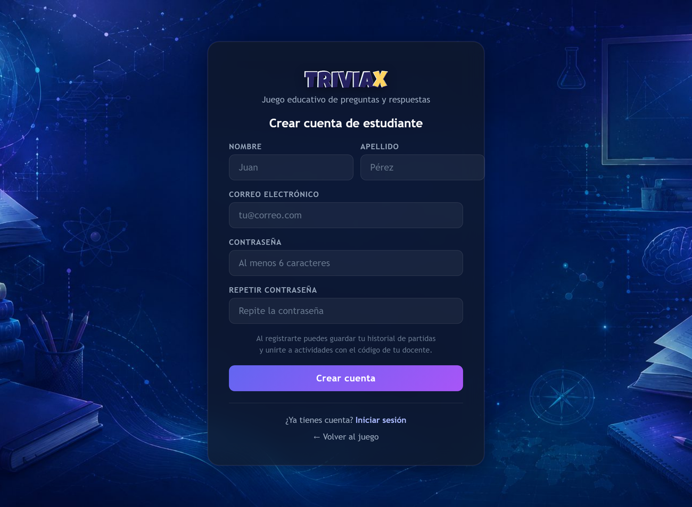

# Manual del Estudiante — TRIVIAX

> **El Camino del Conocimiento**
> Aprende jugando: tableros, fichas de estudio y desafíos en vivo.

---

## Índice

1. [Qué es TRIVIAX](#1-qué-es-triviax)
2. [Qué puedes esperar como estudiante](#2-qué-puedes-esperar-como-estudiante)
3. [¿Necesito una cuenta?](#3-necesito-una-cuenta)
4. [Crear tu cuenta (opcional)](#4-crear-tu-cuenta-opcional)
5. [Unirte a una partida de tablero](#5-unirte-a-una-partida-de-tablero)
6. [Cómo se juega el tablero](#6-cómo-se-juega-el-tablero)
7. [Estudia y Responde](#7-estudia-y-responde)
8. [Participar en TRIVIAX Lotto](#8-participar-en-triviax-lotto)
9. [Consejos para que todo salga bien](#9-consejos-para-que-todo-salga-bien)
10. [Privacidad y respeto](#10-privacidad-y-respeto)

---

## 1. Qué es TRIVIAX

**TRIVIAX** es una plataforma donde **aprender se convierte en juego**. En lugar de resolver una hoja de preguntas, avanzas por un tablero tirando dados, estudias con fichas que se adaptan a ti o participas en desafíos en vivo proyectados en la pizarra de tu salón.

Lo usa tu docente para preparar las actividades, y tú entras a jugar, estudiar y demostrar lo que sabes. No tienes que instalar nada: funciona desde el navegador de tu **celular, tablet o computadora**.

*Pantalla de inicio: desde aquí empiezas a jugar.*

---

## 2. Qué puedes esperar como estudiante

Con TRIVIAX vas a poder:

- **Unirte a partidas** de tablero con un código que te da tu docente y competir con tus compañeros, solo o en equipo.
- **Responder desafíos variados**: opción múltiple, verdadero o falso, asociar pares, ordenar pasos, clasificar elementos y completar frases.
- **Estudiar a tu ritmo** con fichas inteligentes que insisten justo en lo que más te cuesta, para que lo aprendas de verdad.
- **Participar en evaluaciones en vivo** con sorteos en la pizarra, donde lees, escribes tu respuesta y luego la defiendes oralmente.
- **Guardar tu historial** de partidas, si decides crear una cuenta (es opcional).

La idea es que aprendas **disfrutando** y veas tu progreso.

---

## 3. ¿Necesito una cuenta?

**No es obligatorio.** Puedes sumarte a la mayoría de las actividades como **invitado**, simplemente con el código que te comparte tu docente.

Crear una cuenta sirve para una cosa concreta: **guardar tu historial** de partidas y resultados. Si te gusta llevar registro de tu progreso, vale la pena; si no, igual puedes jugar sin problemas.

---

## 4. Crear tu cuenta (opcional)

Si quieres tu propia cuenta:

1. En la pantalla de inicio, elige **Crear cuenta** (la opción de estudiante).
2. Completa tu **nombre, apellido, correo** y una **contraseña** (mínimo 6 caracteres).
3. Si aparece una breve **verificación anti-robots**, complétala; casi siempre es automática.
4. Revisa tu **correo**: recibirás un enlace para **activar** la cuenta. Al abrirlo, tu cuenta queda lista y entras automáticamente.

> Si no ves el correo en unos minutos, mira en la carpeta de spam o correo no deseado.

*Crear cuenta de estudiante: solo tus datos básicos y una contraseña.*

A partir de ahí, ingresas siempre con tu **correo y contraseña**.

*Inicio de sesión: ingresa con tu correo y contraseña cuando vuelvas.*

---

## 5. Unirte a una partida de tablero

Tu docente crea una partida y te entrega un **código de acceso de 6 caracteres** (por ejemplo, `MAT102`).

1. Abre TRIVIAX en tu dispositivo.
2. Escribe el **código** que te dieron.
3. Ingresa tu **nombre o apodo** (o el de tu equipo).
4. ¡Listo! Ya estás dentro de la partida.

> Si tu docente te pasa un **enlace de invitación**, al abrirlo el código se completa solo y entras directo.

**Importante:** ingresa el código tal como te lo dieron. Si juegas sin código, la partida sirve para practicar pero tus puntos no se guardan.

---

## 6. Cómo se juega el tablero

El tablero es la modalidad estrella. Compiten hasta **4 jugadores o equipos**.

- En tu turno, **tiras el dado** y tu ficha avanza por las casillas.
- Al caer en una casilla, aparece un **desafío** que debes resolver.
- Si aciertas, sumas **puntos** y avanzas; según la configuración, fallar puede hacerte **perder el turno** o **restar puntos**.
- Algunas preguntas tienen **tiempo límite** (por ejemplo, 30 segundos): respóndelas con calma pero sin demorarte.

Hay distintos tableros (más largos o más cortos) y distintas formas de ganar: llegar a la meta, llegar con el número exacto o alcanzar primero un puntaje objetivo. Tu docente elige cuál usar.

### Tipos de desafío que verás

| Desafío | Qué tienes que hacer |
|---|---|
| **Opción múltiple** | Elegir la respuesta correcta entre varias. |
| **Verdadero / Falso** | Decir si la afirmación es verdadera o falsa. |
| **Asociar pares** | Unir cada término con su definición. |
| **Ordenar elementos** | Colocar los pasos o elementos en el orden correcto. |
| **Clasificar elementos** | Arrastrar cada elemento a su grupo. |
| **Completar espacios** | Elegir la palabra que falta en cada hueco. |

### Juego limpio

TRIVIAX cuida que la partida sea **justa**: tus puntos se cuentan una sola vez aunque toques el botón varias veces por mala señal, y nadie puede responder en tu nombre. Si abres la misma partida en **dos pestañas**, una quedará en **solo lectura**; cierra la que no uses.

---

## 7. Estudia y Responde

Esta modalidad es para **estudiar por tu cuenta**, sin dados ni competencia. Avanzas por un mazo de **fichas**: cada una te enseña un concepto corto y después te hace una pregunta.

Lo mejor es que **se adapta a ti**:

- Si **respondes bien**, esa ficha tardará más en volver a aparecer.
- Si **fallas**, volverá pronto para que la repases.

Así repasas **justo lo que más te cuesta**, hasta dominarlo. Es una forma muy efectiva de prepararte para una prueba.

Para usarla, entra al mazo que te compartió tu docente o búscalo en la **biblioteca de estudio**, donde están las actividades disponibles. Avanza ficha por ficha, sin apuro: el objetivo es **aprender**, no terminar rápido.

*Biblioteca de estudio: elige un mazo y pulsa "Comenzar".*

---

## 8. Participar en TRIVIAX Lotto

**TRIVIAX Lotto** es una actividad **en vivo en el salón**, con la pizarra proyectada por tu docente. Combina estudio, escritura y exposición oral. Tiene varias fases:

1. **Ingreso.** Tu docente proyecta la pizarra. Tú entras desde tu dispositivo con el **código** de la actividad y eliges tu **número de lista**.

*Ingreso a Lotto desde tu celular: escribe el código y tu número de lista.*
2. **Estudio.** En tu pantalla aparece una **ficha** con el texto y las preguntas guía de tu tema (todavía sin las respuestas). Tienes un tiempo para leer y prepararte.
3. **Respuesta escrita.** Redactas y **envías** tu respuesta a la pregunta de tu tema. Revísala bien antes de enviarla: el envío es definitivo.
4. **Rondas orales.** Las pantallas se bloquean y en la pizarra empieza un **sorteo**: las tarjetas giran y se detienen en un estudiante. Si te toca, prepárate para **explicar tu tema en voz alta**.
5. **Evaluación.** Tu docente revisa tu respuesta y te hace una pregunta oral, calificando con una rúbrica.

> **Mantén tu dispositivo conectado y con batería.** Si te desconectas, tu lugar se marca como "desconectado" en la pizarra. Si pasa, avísale a tu docente: puede **liberar** tu número para que vuelvas a ingresar.

---

## 9. Consejos para que todo salga bien

- **Usa el código correcto.** Cópialo tal cual te lo dieron, respetando mayúsculas.
- **Una sola pestaña.** No abras la misma actividad en varias pestañas o ventanas.
- **Cuida tu conexión y batería**, sobre todo en las actividades en vivo.
- **Lee con atención** cada consigna antes de responder; muchos errores son por leer rápido.
- **En las fichas de estudio, no corras.** Repasar bien vale más que avanzar rápido.
- **Si algo se traba**, recarga la página y vuelve a entrar con el mismo código; tu lugar suele conservarse.

---

## 10. Privacidad y respeto

- Tu **contraseña** se guarda de forma cifrada: nadie puede verla, ni siquiera quien administra el sistema.
- **No compartas** tu contraseña ni el código de una actividad con personas ajenas a tu clase.
- Usa un **nombre o apodo apropiado** al unirte: lo verán tu docente y tus compañeros en la pantalla.
- Las respuestas correctas están **protegidas**: no se pueden "espiar" desde el navegador, así que la mejor estrategia siempre es **estudiar y participar**.

---

*TRIVIAX — El Camino del Conocimiento.*
